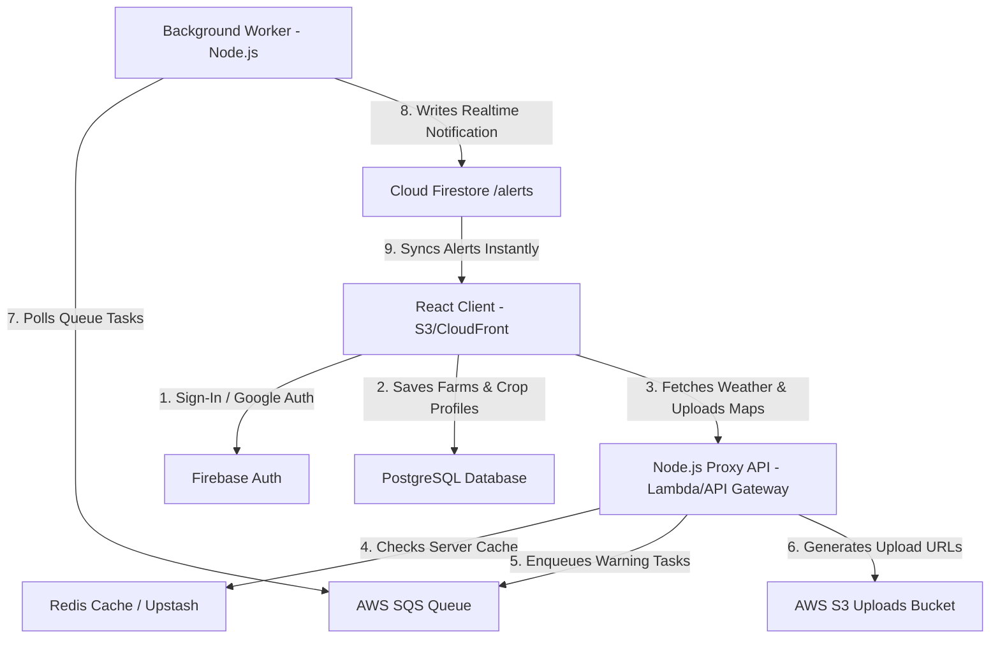

# 🌱 TerraClimate - Full-Stack Precision Agriculture Dashboard

TerraClimate is a serverless, decoupled full-stack precision agricultural planning tool and diagnostics telemetry console built using **React, Tailwind CSS v4, Node.js/Express, PostgreSQL, and AWS (CDK, SQS, Lambda, CloudFront, S3)**. 

It translates raw micro-climate weather feeds from the WeatherAI API into localized, crop-specific advisory actions (e.g. pesticide spray warnings, heavy rain holds, frost alerts) for smallholder farmers, while demonstrating resilient systems engineering.

---

## 🏛️ System Architecture



---

## 🛠️ The Tech Stack

*   **Frontend**: React (Vite), Tailwind CSS v4, Recharts (weather trend curves), React Icons.
*   **Backend**: Node.js + Express wrapped via `@vendia/serverless-express` running serverlessly in **AWS Lambda** via **AWS API Gateway**.
*   **Database**: **PostgreSQL** managed via **Prisma ORM** (handling relational schema migrations).
*   **Auth & Real-Time Sync**: **Firebase Auth** (user sessions) + **Cloud Firestore** (pushing realtime notifications using `onSnapshot` listeners).
*   **Caching**: **Redis** (via Upstash in production or local Docker Redis service).
*   **Message Broker**: **AWS SQS** (via AWS SQS or local Docker ElasticMQ service).
*   **Asset Storage**: **AWS S3** (storing farm blueprints/maps via secure S3 Presigned PUT URLs).
*   **IaC**: **AWS CDK** in TypeScript (defining all cloud resources).

---

## 📁 Project Folder Layout

```
weather-ai/
├── backend/                  # Express serverless API & SQS Worker
│   ├── prisma/               # Schema definitions and database migrations
│   └── src/
│       ├── core/             # Redis cache, SQS queue, S3 upload config wrappers
│       ├── modules/          # Feature endpoints (weather, farms, notifications)
│       ├── workers/          # background SQS consumer worker
│       └── server.js         # Local HTTP Server entry point
│
├── frontend/                 # Vite React SPA
│   └── src/
│       ├── components/       # ImageUpload node and Realtime Toast selectors
│       ├── views/            # FarmPlanner, AgriTimeline, and Diagnostics console
│       └── services/         # Firebase Client SDK & API proxy configurations
│
└── infra/                    # Infrastructure as Code (AWS CDK TypeScript)
    ├── bin/cdk.ts            # App synth entry point
    └── lib/terraclimate-stack.ts  # provisions CloudFront, S3, SQS, Lambda, and API Gateway
```

---

## ⚡ Caching & Queue Resiliency (Scaling Shields)

To safeguard the WeatherAI Free Plan rate limit (5 requests/second):
1.  **Rate-Limit Staggering**: Outgoing API queries are queued and staggered on the backend by **200ms** to prevent concurrent spikes from returning HTTP 429 errors.
2.  **Caching (Weather API)**: Backend requests are cached for **15 minutes** in Redis (either cloud Upstash or local Docker Redis) to stay within the query quota.
3.  **SQS Message Worker**: Alerts are pushed to an SQS queue (AWS SQS or local Docker ElasticMQ SQS). A background consumer worker polls the queue, updates the PostgreSQL database, and writes realtime alert broadcasts to Firestore.
4.  **S3 Uploads**: Drone satellite maps are uploaded directly from the browser using secure S3 presigned PUT tokens generated by the backend.

---

## ⚙️ Environmental Setup

To run the application, configure environment files in both folders. Copy the templates:

*   **Backend (`backend/.env`)**: Follow [backend/.env.example](file:///Users/sharifhossain/Documents/Personal/assesment/weather-ai/backend/.env.example)
*   **Frontend (`frontend/.env`)**:
    ```env
    VITE_API_URL="http://localhost:3000"
    VITE_FIREBASE_API_KEY="your-firebase-api-key"
    VITE_FIREBASE_AUTH_DOMAIN="your-firebase-auth-domain"
    VITE_FIREBASE_PROJECT_ID="your-firebase-project-id"
    VITE_FIREBASE_STORAGE_BUCKET="your-firebase-storage-bucket"
    VITE_FIREBASE_SENDER_ID="your-firebase-sender-id"
    VITE_FIREBASE_APP_ID="your-firebase-app-id"
    ```
    *Note: All environment keys must be filled out for the frontend to communicate with your backend and database services correctly.*

---

## 🚀 Running Locally (Docker-Compose Sandbox)

You can run the entire application, database migration, and background workers locally. The project includes a `/local-services` folder providing offline emulators for SQS, Redis, and Postgres via Docker Compose.

1.  **Install dependencies across all directories**:
    ```bash
    npm run install:all
    ```

2.  **Spin up local Docker dependencies (PostgreSQL, Redis, SQS/ElasticMQ)**:
    Navigate to the `local-services` directory and boot the containers:
    ```bash
    cd local-services
    docker-compose up -d
    ```
    This launches:
    *   **PostgreSQL** (`localhost:5432`)
    *   **Redis Cache** (`localhost:6379`)
    *   **ElasticMQ SQS Emulator** (`localhost:9324` API, `localhost:9325` management page)
    *   **pgAdmin Database Browser** (`localhost:5050`)
    *   **Redis Commander Cache Browser** (`localhost:8081`)

3.  **Initialize PostgreSQL Database & run Migrations**:
    Open a new terminal, navigate to `/backend`, and execute Prisma migrations:
    ```bash
    cd backend
    npm run db:migrate
    ```

4.  **Boot Frontend, Backend, and Background Worker concurrently**:
    From the root directory of the project, run:
    ```bash
    npm run dev:all
    ```
    *   **Frontend Client**: `http://localhost:5173`
    *   **Backend API**: `http://localhost:3000`
    *   **API Health Status**: `http://localhost:3000/health`

---

## ☁️ Deploying to AWS (Infrastructure as Code)

To deploy the entire serverless architecture (S3 Bucket, CloudFront CDN, SQS queue, API Gateway, and Lambda Function) to AWS:

1.  **Configure AWS CLI credentials** in your terminal.
2.  **Navigate to the `/infra` folder**:
    ```bash
    cd infra
    ```
3.  **Synthesize CloudFormation templates**:
    ```bash
    npx cdk synth
    ```
4.  **Deploy Stack to AWS**:
    ```bash
    npx cdk deploy
    ```
    *CDK will output your CloudFront Distribution URL (Frontend) and API Gateway Base URL (Backend API).*
