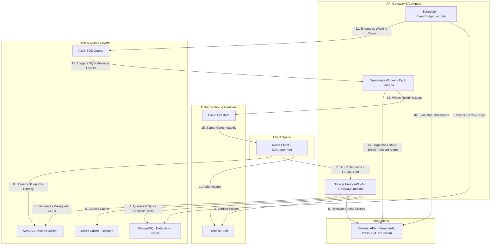

# 🌱 TerraClimate - Full-Stack Precision Agriculture Dashboard

TerraClimate is a serverless, decoupled full-stack precision agricultural planning tool and tenant settings console built using **React, Tailwind CSS v4, Node.js/Express, PostgreSQL, and AWS (CDK, SQS, Lambda, CloudFront, S3)**. 

It translates raw micro-climate weather feeds from the WeatherAI API into localized, crop-specific advisory actions (e.g. pesticide spray warnings, heavy rain holds, storm alerts) for smallholder farmers, while demonstrating resilient systems engineering and multi-tenant SaaS API isolation.

---

## 🏛️ System Architecture



---

## 🛠️ The Tech Stack

*   **Frontend**: React (Vite), Tailwind CSS v4, Recharts (weather trend curves), React Icons.
*   **Backend**: Node.js + Express wrapped via `@vendia/serverless-express` running serverlessly in **AWS Lambda** via **AWS API Gateway**.
*   **Database**: **PostgreSQL** managed via **Prisma ORM** (handling relational schema migrations).
*   **Auth & Real-Time Sync**: **Firebase Auth** (user sessions) + **Cloud Firestore** (pushing realtime notifications using `onSnapshot` listeners).
*   **Caching**: **Redis** (via Upstash in production or local Docker Redis service).
*   **Message Broker**: **AWS SQS** (via AWS SQS or local Docker ElasticMQ service).
*   **Asset Storage**: **AWS S3** (storing farm blueprints/maps via secure S3 Presigned PUT URLs).
*   **IaC**: **AWS CDK** in TypeScript (defining all cloud resources).

---

## 📁 Project Folder Layout

```
weather-ai/
├── backend/                  # Express serverless API & SQS Worker
│   ├── prisma/               # Schema definitions and database migrations
│   └── src/
│       ├── core/             # Redis cache, SQS queue, S3 upload config wrappers
│       ├── modules/          # Feature endpoints (weather, farms, notifications)
│       ├── workers/          # background SQS consumer worker
│       └── server.js         # Local HTTP Server entry point
│
├── frontend/                 # Vite React SPA
│   └── src/
│       ├── components/       # ImageUpload node and Realtime Toast selectors
│       ├── views/            # FarmPlanner, AgriTimeline, and Diagnostics console
│       └── services/         # Firebase Client SDK & API proxy configurations
│
└── infra/                    # Infrastructure as Code (AWS CDK TypeScript)
    ├── bin/cdk.ts            # App synth entry point
    └── lib/terraclimate-stack.ts  # provisions CloudFront, S3, SQS, Lambda, and API Gateway
```

---

## ⚡ Caching, SaaS Isolation & Queue Resiliency (Scaling Shields)

To safeguard the application from scale limits and ensure high availability:
1.  **Multi-Tenant SaaS Key Model**: Outgoing API credentials are isolated per user account. Rather than relying on a shared backend env token, users configure their personal keys in settings. Telemetry, background scanner runs, and query widgets are strictly scoped to the tenant's key.
2.  **On-the-Fly DB Sync**: When users authenticate via standard sign-in or Google SSO, the Express middleware automatically creates/updates their record in PostgreSQL if they are a first-time visitor.
3.  **Rate-Limit Sliding Window**: Outgoing API queries are queued and staggered via an async throttler window to respect WeatherAI's 5 req/sec rate limits.
4.  **Cache-Aside (Redis)**: Outbound endpoints are cached for **15 minutes** (Redis/Upstash) to speed up load times and prevent excessive API credit billing.
5.  **EventBridge Cron & SQS Workers**: Advisory scanners execute as an EventBridge schedule Lambda every 15 minutes. Warning triggers are enqueued to AWS SQS and processed serverlessly by SQS Lambda consumers, dispatching notifications across Firestore, Email, SMS (Twilio), and Discord.
6.  **Direct S3 Browser Uploads**: Satellite maps are uploaded securely from the client directly to S3 using short-lived S3 Presigned PUT URLs, preventing server bandwidth congestion.

---

## ⚙️ Environmental Setup

To run the application, configure environment files in both folders.

---

## 🚀 Running Locally (Docker-Compose Sandbox)

You can run the entire application, database migration, and background workers locally. The project includes a `/local-services` folder providing offline emulators for SQS, Redis, and Postgres via Docker Compose.

1.  **Install dependencies across all directories**:
    ```bash
    npm run install:all
    ```

2.  **Spin up local Docker dependencies (PostgreSQL, Redis, SQS/ElasticMQ)**:
    Navigate to the `local-services` directory and boot the containers:
    ```bash
    cd local-services
    docker-compose up -d
    ```
    This launches:
    *   **PostgreSQL** (`localhost:5432`)
    *   **Redis Cache** (`localhost:6379`)
    *   **ElasticMQ SQS Emulator** (`localhost:9324` API, `localhost:9325` management page)
    *   **pgAdmin Database Browser** (`localhost:5050`)
    *   **Redis Commander Cache Browser** (`localhost:8081`)

3.  **Initialize PostgreSQL Database & run Migrations**:
    Open a new terminal, navigate to `/backend`, and execute Prisma migrations:
    ```bash
    cd backend
    npm run db:migrate
    ```

4.  **Boot Frontend, Backend, and Background Worker concurrently**:
    From the root directory of the project, run:
    ```bash
    npm run dev:all
    ```
    *   **Frontend Client**: `http://localhost:5173`
    *   **Backend API**: `http://localhost:3000`
    *   **API Health Status**: `http://localhost:3000/health`

---

## ☁️ Deploying to AWS (Infrastructure as Code)

To deploy the entire serverless architecture (S3 Bucket, CloudFront CDN, SQS queue, API Gateway, and Lambda Function) to AWS:

1.  **Configure AWS CLI credentials** in your terminal.
2.  **Navigate to the `/infra` folder**:
    ```bash
    cd infra
    ```
3.  **Synthesize CloudFormation templates**:
    ```bash
    npx cdk synth
    ```
4.  **Deploy Stack to AWS**:
    ```bash
    npx cdk deploy
    ```
    *CDK will output your CloudFront Distribution URL (Frontend) and API Gateway Base URL (Backend API).*
